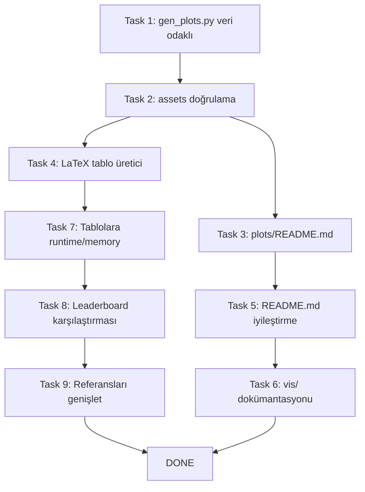

# Plan: Rapor / Görselleştirme / Dokümantasyon İyileştirmeleri

## Mevcut Durum Özeti

Projede halihazırda aşağıdaki bileşenler mevcut:

### ✅ Var Olanlar

| Bileşen | Durum | Detay |
|---------|-------|-------|
| `src/vis/plots.py` | ✅ Tam | 7 farklı Plotly grafik fonksiyonu (`plot_hits_comparison`, `plot_scale_heatmap`, `plot_training_curves`, `plot_runtime_vs_accuracy`, `plot_memory_comparison`, `plot_runtime_comparison`, `plot_multi_seed_box`) + `save_all_plots()` |
| `src/vis/tables.py` | ✅ Tam | `make_summary_table()`, `make_best_results_table()` |
| `latex/report.tex` | ✅ Mevcut | 339 satırlık, 4 figürlü, 4 referanslı akademik rapor — iyi yapılandırılmış |
| `latex/gen_plots.py` | ⚠️ Hardcoded | Matplotlib ile çizim yapar ama **ham veri kullanır**, sonuç dosyalarından okumaz |
| `latex/figures/` | ✅ Tam | 4 PDF figür mevcut |
| `results/plots/` | ⚠️ Kısmi | Sadece 3 PNG var (hits, runtime, memory); diğer 4 plot tipi eksik |
| `main.py assets` | ✅ Mevcut | `generate_report_assets()` → `save_all_plots()` çağırır |
| README / ARC / PLAN | ✅ Mevcut | Temel dokümantasyon var |

### Rapor Değerlendirmesi (1-10)

| Kriter | Puan |
|--------|------|
| Yapı ve akış | 9/10 |
| Teknik doğruluk | 9/10 |
| Figür kalitesi | 7/10 |
| Tekrar üretilebilirlik | 5/10 |
| Literatür bağlamı | 6/10 |
| Derinlik (analiz) | 8/10 |
| Kapsam | 8/10 |

---

## Yapılacak İşler — 9 Task

### Task 1: `latex/gen_plots.py`'ı Veri Odaklı Yap

**Amaç:** `gen_plots.py`'ın `results/raw/summary.csv` veya JSON dosyalarından veri okuyarak grafik üretmesini sağlamak.

**Değişiklikler:**
- `pandas` ile `summary.csv` okuma
- Mevcut hardcoded `data` sözlüğü yerine CSV'den method-scale bazlı Hits@50 değerlerini çekme
- Multi-seed verileri için `results/raw/multi_seed/` altındaki JSON'lardan okuma
- Aynı Matplotlib grafik formatını koruma (PDF çıktısı, LaTeX uyumlu)

**Dosya:** `latex/gen_plots.py`

---

### Task 2: Tüm Plotly Grafiklerinin `main.py assets` ile Üretilmesi

**Amaç:** `python main.py assets` komutunun 7 plot tipini de başarıyla üretmesini sağlamak.

**Kontrol listesi:**
- `plot_hits_comparison()` → `hits_comparison.png`
- `plot_scale_heatmap()` → `scale_heatmap.png`
- `plot_training_curves()` → `training_curves*.png`
- `plot_runtime_vs_accuracy()` → `runtime_vs_accuracy.png`
- `plot_memory_comparison()` → `memory_comparison.png`
- `plot_runtime_comparison()` → `runtime_comparison.png`
- `plot_multi_seed_box()` → `multi_seed_box.png`

**Not:** `plotly`'nin `write_image` için `kaleido` gerekebilir. Eksikse `requirements.txt`'e eklenmeli.

**Dosyalar:** `src/vis/plots.py`, `main.py`, `requirements.txt`

---

### Task 3: `results/plots/README.md` — Plot Referansı

**Amaç:** Hangi plot fonksiyonunun hangi dosyayı ürettiğini gösteren basit bir referans dokümanı.

**Yeni dosya:** `results/plots/README.md`

```markdown
# Generated Plots

| Dosya | Fonksiyon | Açıklama |
|-------|-----------|----------|
| hits_comparison.png | plot_hits_comparison() | Grouped bar: Hits@K by method x scale |
| scale_heatmap.png | plot_scale_heatmap() | Heatmap: method x scale |
| training_curves.png | plot_training_curves() | Loss curves for MLP/GCN |
| runtime_vs_accuracy.png | plot_runtime_vs_accuracy() | Scatter: runtime vs accuracy |
| memory_comparison.png | plot_memory_comparison() | Bar: memory by method x scale |
| runtime_comparison.png | plot_runtime_comparison() | Bar: runtime by method x scale |
| multi_seed_box.png | plot_multi_seed_box() | Box: distribution across seeds |
```

---

### Task 4: LaTeX Uyumlu Tablo Üretici Script

**Amaç:** Deney sonuçlarından otomatik LaTeX tablosu üreten bir script yazmak.

**Yeni dosya:** `scripts/generate_latex_tables.py`

**Özellikler:**
- `results/raw/` altındaki JSON'lardan en iyi sonuçları okuma
- `booktabs` formatında LaTeX tablosu çıktısı üretme
- `report.tex`'teki mevcut tablolarla uyumlu format
- Runtime ve memory sütunlarını da içerme (Task 7 ile uyumlu)

---

### Task 5: README.md İyileştirme

**Amaç:** Görselleştirme pipeline'ını ve rapor üretimini README'de belgelemek.

**Eklenecek bölümler:**
1. **Görselleştirme Pipeline'ı** — `main.py assets` komutunun açıklaması
2. **Rapor Üretimi** — LaTeX raporunun nasıl derleneceği
3. **Yeni Plot Ekleme** — Kısa rehber
4. **Sonuç Dosyaları** — JSON, CSV, PNG formatlarının açıklaması

**Dosya:** `README.md`

---

### Task 6: `src/vis/` Modül Dokümantasyonu

**Amaç:** `src/vis/` modülüne eksik docstring'leri eklemek.

**Dosyalar:**
- `src/vis/__init__.py` — Modül doküstrasyonu
- `src/vis/plots.py` — Her fonksiyona parametre/dönüş doküstrasyonu
- `src/vis/tables.py` — Tablo fonksiyon docstring'leri

---

### Task 7: `report.tex` Tablolarına Runtime/Memory Sütunları Ekleme

**Amaç:** Ana karşılaştırma tablosuna (Tab. 1) runtime (saniye) ve memory (MB) sütunlarını eklemek.

**Mevcut tablo sütunları:** Method, Scale, Hits@50, Hits@100, vs. CN
**Eklenecek sütunlar:** Runtime (s), Memory (MB)

Bu sayede okuyucu sadece doğruluk değil, **efficiency trade-off'larını** da tek tabloda görebilir.

**Dosya:** `latex/report.tex`

---

### Task 8: OGB-collab Leaderboard Karşılaştırması

**Amaç:** Proje sonuçlarını literatürdeki bilinen baselinelarla karşılaştıran kısa bir bölüm eklemek.

**İçerik:**
- OGB-collab leaderboard'da raporlanan Hits@50 değerleri
- Örnek: SEAL (~0.688), GCN (~0.482), Node2Vec vb.
- Projenin sonuçlarının bu bağlamda konumlandırılması
- "Our GCN achieves 0.457 vs. reported 0.482 — the gap is partly due to hyperparameter differences and reduced training epochs"

**Dosya:** `latex/report.tex` (yeni subsection, ör. "Comparison with Literature")

---

### Task 9: Referansları Genişletme

**Amaç:** Mevcut 4 referansı (OGB, Newman, Kipf, Zhang) genişletmek.

**Eklenecek referanslar:**
| Referans | Yer | Gerekçe |
|----------|-----|---------|
| Hamilton et al., GraphSAGE (NeurIPS 2017) | Task 8 leaderboard | GNN baseline |
| Veličković et al., GAT (ICLR 2018) | Task 8 leaderboard | Attention-based GNN |
| Zhang & Chen, SEAL (NeurIPS 2018) | Task 8 leaderboard | SOTA on OGB-collab |
| OGB-collab leaderboard results | Task 8 | Direct comparison |
| Fey & Lenssen, PyG (JMLR 2019) | Sec 4 Architecture | Framework citation |

**Dosya:** `latex/report.tex` (thebibliography)

---

## İş Akışı



## Bağımlılıklar

- **Task 1** → bağımsız (kendi kendine yeten script)
- **Task 2** → Task 3'ün ön koşulu (plotlar üretilince referans eklenir)
- **Task 4** → Task 7'nin ön koşulu (tablo üretici script, runtime/memory sütunlarını da üretir)
- **Task 7** → Task 8 ve 9 ile bağlantılı (tablolar güncellenince leaderboard karşılaştırması anlamlı olur)
- **Task 5, 6** → diğerlerinden bağımsız, son dokümantasyon adımları

## Kabul Kriterleri

- [x] `python latex/gen_plots.py` çalıştırıldığında hardcoded veri OLMADAN doğru grafik üretir
- [x] `python main.py assets` tüm 7 plot tipini `results/plots/` altına üretir
- [x] `results/plots/README.md` her plot dosyasını fonksiyonuna eşler
- [x] `scripts/generate_latex_tables.py` geçerli LaTeX tablosu (runtime+memory dahil) üretir
- [x] `report.tex` ana tablosunda runtime ve memory sütunları var
- [x] `report.tex`'te literatür karşılaştırma bölümü var
- [x] `report.tex` referans listesi en az 7 kaynak içeriyor
- [x] README.md görselleştirme pipeline'ını açıklıyor
- [x] `src/vis/` modülü eksiksiz docstring'lere sahip
